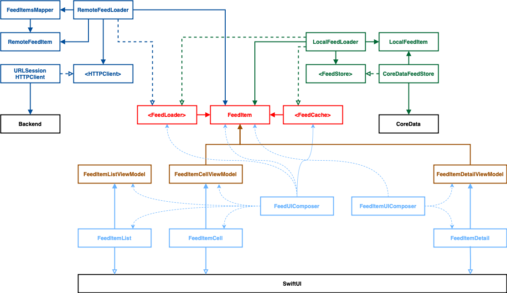

# My Deliveries

Thank you for taking the time to review this repo!

While just a simple project, I wanted to give insight on how I would tackle the requirements given that this were an expanding project and code that would eventually make it onto the App Store.

## Getting Started
I don't use any third party frameworks, so there's no need for any extra steps to get the project running.

## Architecture
While not 100% complete, I hope this gives insight into how the app is structured and my line of reasoning when designing the app. My goal was to provide flexibility, testability, and reusability.

## Tests
Unfortunately I didn't have time to write tests, you'll find test for `URLSessionHTTPClient`  and use case tests for `RemoteFeedLoader`.

With more time I would have loved to write more unit tests, as well as integration, snapshot, end-to-end. I avoid UI tests when possible opting to reduce test times; instead I opt for programmatically interacting with `UIView`s or using frameworks like `ViewInspector` when using SwiftUI.

## Important!
Because of time constraints I was unable to get `CoreData` and persistence working; instead I have an `InFeedMemoryStore` in its place.
Additionally the endpoint I was using did not accept an `offset` parameter, as well it returned unspecified objects; I was unable to investigate further, but there is a `RemoteFeedLoaderStub` that will act in its place.

## Improvements
There are some things I wish I could have improved on such as:
- Error handling
- Consolidate platform agnostic components into their own module

## Additionally
I hope you enjoy reviewing my code! If you have any questions please fill free to reach out.
